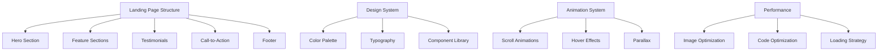

# System Patterns: Website Structure Guide

## Website Architecture

This template follows a modern, component-based architecture optimized for both visual appeal and performance:



## Website Sections & Purpose

### 1. Hero Section
The first screen visitors see, designed to make an immediate impression.

**Purpose**:
- Communicate your primary value proposition
- Create visual impact to engage visitors
- Provide a clear call-to-action
- Set the tone for your brand

**Recommended Elements**:
- Eye-catching headline: "Showcasing Excellence in Portfolio Design"
- Supporting subheadline: "Padleo Solutions brings your creative vision to life with a modern and blue-inspired design that stands out."
- Primary call-to-action button: "Explore Our Work"
- Background image or animated gradient in blue tones
- Optional: Social proof indicators such as client logos or project numbers

### 2. Feature Section
Highlights the key benefits and features of your portfolio offerings.

**Purpose**:
- Showcase what makes your portfolio valuable and unique
- Address user needs with creative solutions tailored for visionaries and innovators
- Provide visual explanations of your design process and projects
- Support your claims with evidence from past successful projects

**Recommended Elements**:
- 3-6 key features with icons or illustrations:
  - Custom Creative Designs
  - Responsive & Modern Layouts
  - Seamless User Experience
- Brief, benefit-focused descriptions for each feature emphasizing design, innovation, and professionalism
- Visual hierarchy that guides the eye with blue accent colors
- Optional: Interactive elements such as hover effects on feature cards

### 3. Testimonials & Social Proof
Evidence that others trust and value Padleo Solutions for their design and portfolio needs.

**Purpose**:
- Build credibility and trust through client stories and feedback
- Address potential doubts using real user experiences and project outcomes
- Show the diversity of successful portfolio projects across creative fields
- Highlight specific outcomes and measurable impact

**Recommended Elements**:
- Customer quotes with names and photos, e.g., "Padleo Solutions transformed our visual identity – truly a game-changer!"
- Case study highlights showing the difference made in project engagement
- Company logos or project badges
- Ratings and reviews if applicable, reinforcing quality and satisfaction

### 4. Call-to-Action Sections
Strategic conversion points throughout the page to encourage visitors to get in touch or view more work.

**Purpose**:
- Guide visitors to take the next step in their creative journey with Padleo Solutions
- Create a sense of urgency to explore the portfolio and services
- Remove friction from the conversion process by simplifying contact options
- Reinforce the value proposition and uniqueness of Padleo Solutions

**Recommended Elements**:
- Clear, action-oriented button text like "Contact Us Today" or "View Portfolio"
- A supporting headline such as "Ready to Elevate Your Portfolio?"
- Minimal form fields if acquiring visitor information (include email field with a prompt to contact at padleobooks@gmail.com)
- Visual design that draws attention with contrasting blue and accent colors

### 5. Footer
Information and navigation that supports the main content and offers additional contact and legal details.

**Purpose**:
- Provide additional navigation options to other parts of the portfolio
- Include required legal information and business credentials
- Offer alternative contact methods for inquiries and project discussions
- Reinforce branding with the distinct blue theme and design cues

**Recommended Elements**:
- Secondary navigation links such as Home, About, Portfolio, Contact
- Contact information clearly listing padleobooks@gmail.com and linking to the website URL: https://eb6d78f0.dreamhosters.ai
- Social media links if available
- Copyright and legal details
- Optional newsletter signup for updates on recent projects and design insights

## Design System Principles

### Color System

This template uses a semantic color system that gives meaning to colors:

```
Primary    → Blue tones to represent trust, creativity, and professionalism
Secondary  → Complementary neutrals to support the primary blue
Accent     → Bright highlights to draw attention to calls-to-action and key features
Background → Clean, light backgrounds to ensure readability and focus on content
Text       → Dark neutral shades for clear and accessible content
```

When customizing colors:
1. Identify blue as the main brand color for Padleo Solutions
2. Create lighter and darker variants of blue for depth and hierarchy
3. Choose neutral colors for text and backgrounds
4. Select accent colors for highlights and calls-to-action

### Typography System

The typography system uses a clear hierarchy:

```
Headings   → Large, bold, attention-grabbing fonts to emphasize portfolio highlights
Subheadings → Medium, distinguishable typography for section introductions
Body       → Readable, comfortable fonts for detailed descriptions and project narratives
Caption    → Small fonts for supporting information such as credits or fine print
```

When customizing typography:
1. Choose a display font for headings that is modern and stylish
2. Select a highly readable font for body text that enhances legibility
3. Limit to 2-3 font families maximum for consistency
4. Establish a clear size hierarchy (e.g., h1 > h2 > h3 > body)

### Animation Guidelines

Animations should enhance content, not distract from it:

**Scroll Animations**:
- Fade in elements as they enter the viewport for a smooth introduction
- Reveal content progressively as users scroll through Padleo Solutions’ portfolio
- Use subtle movement to draw attention to highlighted sections
- Keep animations brief (0.3-0.6 seconds) for optimal performance

**Hover States**:
- Provide clear feedback on interactive elements like buttons and feature cards
- Use subtle scaling, color transitions, or shadows to show interactivity
- Ensure transitions are smooth (0.2-0.3 seconds) to enhance user experience

**Parallax Effects**:
- Create depth by moving background and foreground layers at different speeds
- Use parallax sparingly to avoid distracting from the portfolio content
- Ensure effects do not cause layout shifts for a stable viewing experience
- Consider disabling on mobile devices for performance consistency

## Section Composition Patterns

### Hero Section Patterns

**1. Split Hero**
```
┌─────────────────┬─────────────────┐
│                 │                 │
│  Copy & CTA     │     Image       │
│ (Introducing    │   or Video      │
│ Padleo Solutions│ showcasing work │
│ and values)     │ in a blue theme │
└─────────────────┴─────────────────┘
```

**2. Centered Hero**
```
┌─────────────────────────────────┐
│                                 │
│         Headline:             │
│   "Showcasing Creative          │
│       Excellence"               │
│       Subheadline:              │
│ "Crafting stunning portfolios   │
│  with a modern blue flair"      │
│          CTA:                   │
│       "Explore Our Work"        │
│        Background:              │
│      Blue-themed imagery        │
└─────────────────────────────────┘
```

**3. Full-width Hero with Overlay**
```
┌─────────────────────────────────┐
│                                 │
│    Copy & CTA:                  │
│ "Welcome to Padleo Solutions"   │
│ "Discover the art of portfolio  │
│  design with exceptional detail"│
│                                 │
│   (Overlay on full-width image) │
│                                 │
└─────────────────────────────────┘
```

### Feature Section Patterns

**1. Icon Grid**
```
┌─────────┬─────────┬─────────┐
│  Icon   │  Icon   │  Icon   │
│ Custom  │ Responsive│ Smooth │
│ Designs │ Layouts  │ Experience│
│ "Tailored to│ "Optimized for│ "Intuitive │
│ your vision"│ every device"│ and engaging"│
└─────────┴─────────┴─────────┘
```

**2. Alternating Sections**
```
┌─────────┬─────────┐
│  Image  │  Copy   │
│ (Visual │ "Custom  │
│ Portfolio  │ Solutions for every creative need"│
│ Showcase)│         │
└─────────┴─────────┘

┌─────────┬─────────┐
│  Copy   │  Image  │
│ "Innovative designs │ (Graphic showcasing a project)│
│ and modern solutions"│         │
└─────────┴─────────┘
```

**3. Feature Cards**
```
┌─────────┐   ┌─────────┐   ┌─────────┐
│         │   │         │   │         │
│  Card   │   │  Card   │   │  Card   │
│ "Custom  │   │ "Responsive │ │ "Engaging │
│ Designs" │   │  Layouts"  │ │ Interaction"│
│         │   │         │   │         │
└─────────┘   └─────────┘   └─────────┘
```

### Testimonial Section Patterns

**1. Testimonial Carousel**
```
┌─────────────────────────────────┐
│                                 │
│   ◀   "Padleo Solutions     ▶   │
│       transformed our portfolio;│
│       their blue-inspired design │
│       speaks volumes."           │
│        – Alex R., Creative Lead  │
│                                 │
└─────────────────────────────────┘
```

**2. Testimonial Grid**
```
┌─────────┐   ┌─────────┐
│ "Amazing│   │ "Innovative│
│ results!"│   │ approach!" │
│ – Jamie │   │ – Morgan  │
└─────────┘   └─────────┘
┌─────────┐   ┌─────────┐
│ "A true│   │ "Exceeded│
│ creative│   │ expectations!"│
│ vision!"│   │ – Taylor   │
└─────────┘   └─────────┘
```

**3. Featured Case Study**
```
┌─────────────────────────────────┐
│                                 │
│  Customer: "Creative Agency X"  │
│       Image: (Project Snapshot) │
│          Quote: "Our portfolio   │
│         was reinvented with     │
│       Padleo Solutions' touch"  │
│          Results: 50% more views  │
│         & increased engagement  │
│                                 │
└─────────────────────────────────┘
```

## Responsive Design Principles

This template follows a mobile-first approach with these breakpoints:

```
Mobile:     < 640px
Tablet:     640px - 1024px
Desktop:    > 1024px
```

Key responsive principles:
1. Single column layouts on mobile for clarity
2. Simplified navigation such as a hamburger menu on smaller devices
3. Touch-friendly targets (minimum 44px × 44px) to ensure ease of use
4. Reduced animations on mobile devices to optimize performance
5. Optimized images for each screen size

## SEO & Performance Guidelines

**SEO Best Practices**:
- Use semantic HTML tags (h1, h2, article, etc.) to define page sections
- Include descriptive alt text for images showcasing portfolio work
- Create a logical heading structure (h1 → h2 → h3) to enhance navigation
- Use descriptive, keyword-rich page titles highlighting Padleo Solutions
- Include meta descriptions for all pages to summarize content and keywords

**Performance Optimization**:
- Compress and properly size images related to portfolio projects
- Defer non-critical JavaScript to improve initial load times
- Minimize layout shifts during page load to ensure a smooth experience
- Prioritize loading visible content first for faster interactivity
- Use system fonts or optimized web fonts to maintain consistency and speed

Visit our website for more details: https://eb6d78f0.dreamhosters.ai

For inquiries and collaborations, contact us at padleobooks@gmail.com.
